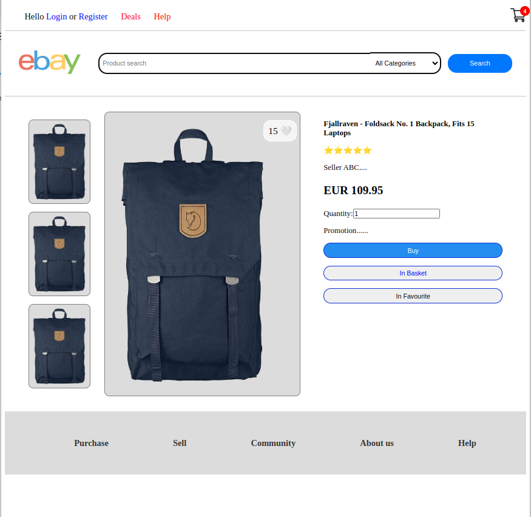
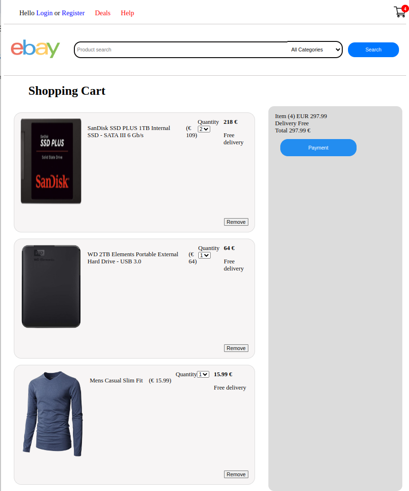

# EbayMock
## I simulated Ebay Website with some features such as show/add/remove products to cart and Login to Profile.
### In this Project, I used React.js for Frontend and Express in Backend with PostgreSQL. The following will show my project:

